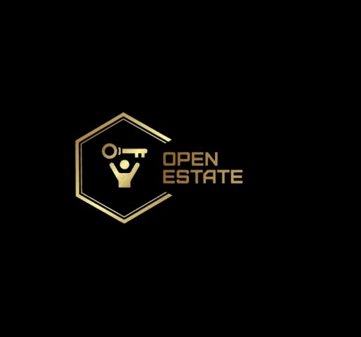

  

<h1 align="center">OpenEstate</h1>

  Own Real Estate Like Buying Shares.  
  Fractional • Transparent • Compliant • Simulated MVP

---

## ✨ Features
- 🔐 OTP Login & KYC (simulated with Firebase & Digilocker)
- 🏠 Browse property listings with full docs (PDFs)
- 💸 Buy tokens (mock payments: PayPal, Bank, Cashfree)
- 📊 Portfolio dashboard with rent distribution
- 🔄 Secondary market simulation
- ⛓ Blockchain-lite ledger simulation (Ethereum testnet ready)
- 🎨 Apple-like UI with GSAP animations

---

## 📂 Project Structure

Apple-like minimal UI. Fractional real estate investing demo with:
- GSAP scroll animations
- Simulated payments (Bank/PayPal/Cashfree)
- Property PDFs
- Faux blockchain explorer
  
## 🚀 Why OpenEstate?
- 📂 Verified properties with full title docs & valuation  
- 💳 Buy fractional tokens (simulated payments)  
- 📊 Track rental income & token ownership in real time  
- ⛓️ Blockchain logs for full transparency  
- 🔄 Liquidity via secondary market (mock trading)  
- 🎬 Smooth Apple-style animations (GSAP-powered)  

---

## 📸 Demo Screenshots
### Homepage

### Property Page

### Dashboard

---

## 🔑 MVP Flow (Live Demo)
1. **Sign Up & KYC** → quick onboarding with phone/email.  
2. **Browse Properties** → price, rent yield, docs, token availability.  
3. **Buy Tokens (Simulated)** → payment via Bank/PayPal/Cashfree.  
4. **View Dashboard** → wallet balance, payouts, blockchain explorer.  
5. **Trade Tokens** → sell to other users in secondary market (mock).  

---

## 💡 Value Proposition
- **Investors**: Start small, diversify into real estate, track ROI.  
- **Property Owners**: Unlock liquidity without selling entire asset.  
- **Market**: Mobilize locked ₹330+ lakh crore wealth into capital.  

---

## 🛠 Tech Highlights
- Next.js + React  
- GSAP animations  
- Firebase Auth (Email, Phone, Google, Microsoft, Apple)  
- Simulated payments (Bank, PayPal, Cashfree)  
- Blockchain-lite logging  
- Vercel hosting  

---

## 📜 License
MIT License © 2025 [VibSinghJATT](https://github.com/VibSinghJATT)

---

✨ *OpenEstate is currently an MVP demo for IITB – showing the future of fractional real estate investing.*

